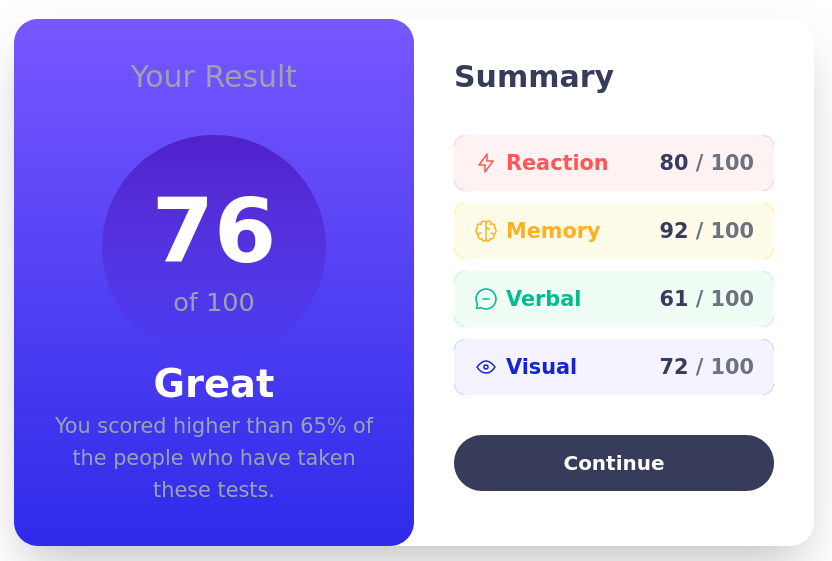
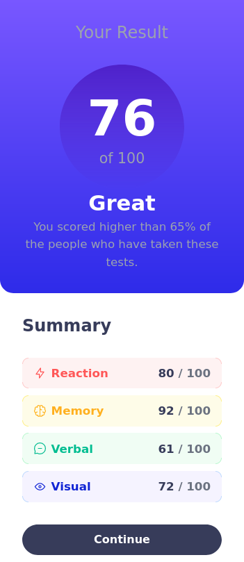

# Frontend Mentor - Results summary component solution

This is a solution to the [Results summary component challenge on Frontend Mentor](https://www.frontendmentor.io/challenges/results-summary-component-CE_K6s0maV). Frontend Mentor challenges help you improve your coding skills by building realistic projects.

## Table of contents

- [Overview](#overview)
  - [The challenge](#the-challenge)
  - [Links](#links)
- [My process](#my-process)
  - [Built with](#built-with)
  - [What I learned](#what-i-learned)
  - [Continued development](#continued-development)
  - [Useful resources](#useful-resources)
- [Author](#author)

## Overview

### The challenge

The challenge was to build out this results summary component and get it looking as close to the design as possible.

Users should be able to:

- View the optimal layout for the interface depending on their device's screen size
- See hover and focus states for all interactive elements on the page

### Screenshot


Screenshot of the final result with the layout for 1440px width



Screenshot of the final result with the layout for 375pxc width

### Links

- Solution URL: [Github repo](https://github.com/hagesake/results-summary-component)
- Live Site URL: [Live site url (Github pages)](https://hagesake.github.io/results-summary-component/src/)

## My process

### Built with

- Semantic HTML5 markup
- Tailwindcss for the styles
- CSS Flexbox based layout
- Mobile-first workflow

### What I learned

The goal with this initial project was to dive and learn to work with Tailwindcss and the approach of the framework to style and build responsive layouts for web UIs. This was an initial encounter to utility classes and a CSS framework after learning the basics of CSS and tinker a little with the classical methods to apply styles and create layouts.

The resulting HTML code,

```html
<button
	class="w-full h-14 text-xl text-white font-semibold rounded-full bg-btn-primary hover:bg-gradient-to-b from-light-slate-blue to-light-royal-blue duration-200">
	Continue
</button>
```

may seem bloated and full of classes names but the use of utility classes remove the pain of struggling with how we name our classes to apply styles to HTML tags. Another advantage I've noticed is the fast prototyping capabilities that Tailwindcss utility classes allow.

Need to highlight that previous knowledge and experience with just plain and regular CSS is a must when talking about applying styles with Tailwindcss. Using the framework with no prior experience with CSS properties for styling and layouts is like trying to pilot a starship but with no equipment, no crew and no starship.

### Continued development

In the development of the project I struggle with positioning, specially in the data presentation components corners. This skill and the aility to bring a .jpeg to a web page exactly as it is in the image are the main focus of my future training and studies. Also I need to go deeper the path of using Tailwindcss as my main tool to style and create responsive layouts.

## Author

- Frontend Mentor - [@yourusername](https://www.frontendmentor.io/profile/hagesake)
- Twitter - [@yourusername](https://www.twitter.com/hage_sake)
